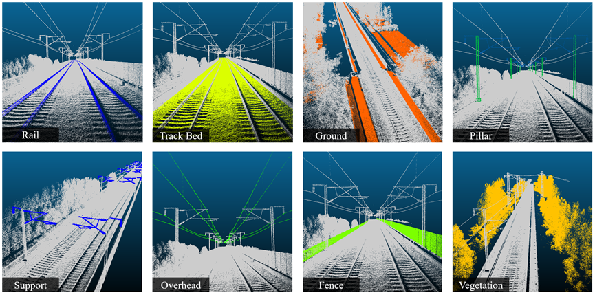

# Express-Rail Dataset
> 这是该项目的中文说明。 [English Version](README.en.md) 

## 简介
本数据集包含铁路轨道及其周围环境的点云数据，旨在为铁路检测、三维建模、数字化等研究领域提供支持。点云数据通过激光雷达设备采集，具有高精度的标签信息。

## 数据集结构
数据集采用 LAS 格式存储，文件夹结构如下：
```bash
/dataset-root
├── README.txt                # 数据集说明文件
├── /train                    # 点云数据存放目录
│   ├── track_segment1.las    # 第一段铁路点云数据
│   ├── track_segment2.las    # 第二段铁路点云数据
│   └── ...
└── /test             
    ├── track_segment1.las   # 第一段铁路点云数据
    ├── track_segment2.las   # 第二段铁路点云数据
    └── ...


```

## 数据预览

| 标签号 | 中文名称      | 英文名称   | 解释                                                                 |
|-------|--------------|------------|----------------------------------------------------------------------|
| 0     | 铁路          | Rail       | 表示铁路轨道的钢轨部分。                                             |
| 1     | 支撑结构      | Support    | 表示铁路相关的支撑结构，如电缆支架。                         |
| 2     | 支柱          | Pillar     | 表示铁路沿线的支柱结构，如电线杆。                           |
| 3     | 接触网      | Overhead   | 表示位于铁路上方的电缆。                     |
| 4     | 围栏/立面设施 | Fence      | 表示铁路周围的围栏、隔音板等立面设施。                               |
| 5     | 轨道床        | Track Bed  | 表示支撑铁路轨道的道砟或道床结构。                                   |
| 6     | 植被          | Vegetation | 表示铁路沿线的植被，如树木、灌木等。                                 |
| 7     | 地面          | Ground     | 表示铁路周围的地面，包括平整路面和边坡。                             |
| 8     | 未分类的点集合 | Others     | 表示未分类的点或不属于其他类别的点。                                 |


我们提供了数据集的示例图片，以帮助快速了解数据内容：  

  

_图1. 铁路点云数据部分展示_


## 使用说明
下载数据集并解压至本地。

## 许可
本数据集允许用于学术研究和非商业用途。使用本数据集时，请引用以下文献：
> 作者名，论文题目，发表期刊/会议，年份。

## 联系方式
如有任何问题或建议，请联系数据集维护者：

姓名：leung
邮箱：gisleung@whu.edu.cn