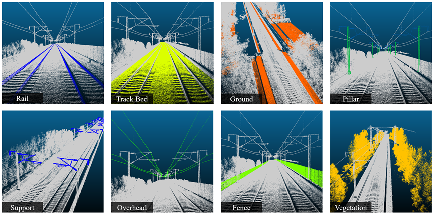

# Express-Rail 点云数据集
 
[English Version](README.md) 

## 🎈 1 简介
1. 数据集概述：本数据集包含铁路轨道及其周围环境的高精度点云数据，旨在支持铁路检测、三维建模和数字化等相关研究。数据通过激光雷达采集，并附有高质量标签。
2. 基准方法：我们提供了多种主流方法在本数据集上的测试结果，代码存放在`code_benchmark`目录中，供参考。
3. 研究贡献：在我们的论文中（投稿中），提出了一种基于主动学习的弱监督方法，用更少标签实现更高语义分割精度，相关代码存放在`code_paper`目录中。

## 🎈 2 数据集

### 2.1 数据格式 
数据集以 LAS 格式存储，文件结构如下：
```bash
/dataset-root
├── README.md                 # 数据集说明文件
├── /train                    # 训练集
│   ├── track_segment1.las    # 第一段铁路点云数据
│   ├── track_segment2.las    # 第二段铁路点云数据
│   └── ...
└── /test                     # 测试集
    ├── track_segment1.las   
    ├── track_segment2.las   
    └── ...
```

### 2.2 标签类别
以下是数据集中各类别的标签说明：  

| 标签号 | 中文名称      | 英文名称   | 解释                                                                 |
|-------|--------------|------------|----------------------------------------------------------------------|
| 0     | 钢轨         | Rail       | 轨道钢轨部分                                             |
| 1     | 支撑结构      | Support    | 铁路相关的支撑结构，如电缆支架。                         |
| 2     | 支柱          | Pillar     | 铁路沿线的支柱结构，如电线杆、支撑柱                           |
| 3     | 接触网      | Overhead Lines  | 位于铁路上方的电缆                    |
| 4     | 围栏/立面设施 | Fence      | 围栏、隔音板等立面设施                               |
| 5     | 轨道床        | Track Bed  | 支撑铁路轨道的道砟或道床结构                                  |
| 6     | 植被          | Vegetation | 沿线植被，如树木、灌木等                               |
| 7     | 地面          | Ground     | 包括平整路面和边坡的地面                            |
| 8     | 未分类的点集合 | Others     | 未分类或不属于其他类别的点                                 |


### 2.3 数据集概览
以下为数据集示例图，帮助快速了解数据内容：  

  

_图. 铁路点云数据部分展示_


### 2.4 下载并使用
* **下载**：请访问 `dataset/README.md` 了解下载方式。
* **使用**：  
 1 使用本仓库提供的代码，参考代码目录内的说明文档。  
 2 根据具体任务需求，自行适配使用。

## 🎈 3 基准方法

### 3.1 实验结果
在本数据集上，我们测试了多种主流基准方法，包括 `PointNet++`、`DGCNN`、`KPConv`、`RandLa-Net`，结果如下：

| Method       | Rail | Support | Pillar | Overhead | Fence | Bed  | Veget. | Ground | Others | mIoU (%) | OA (%) |
|--------------|------|---------|--------|----------|-------|------|--------|--------|--------|----------|--------|
| PointNet++   | 82.0 | 78.9    | 84.1   | 92.9     | 95.6  | 94.5 | 90.1   | 83.1   | 73.8   | 86.1     | 95.0   |
| DGCNN        | 83.4 | 82.0    | 84.2   | 96.7     | 92.7  | 95.0 | 91.9   | 81.4   | 63.6   | 85.6     | 94.8   |
| KPConv       | 86.7 | 79.2    | 87.0   | 95.2     | 95.7  | 95.0 | 92.1   | 83.9   | 75.3   | 87.8     | 95.6   |
| RandLA-Net   | 75.4 | 85.0    | 91.0   | 97.6     | 97.2  | 93.7 | 92.5   | 85.3   | 76.0   | 88.2     | 95.2   |
| Transformer   |  |     |    |      |   |  |    |    |    |      |    |

### 3.2 代码说明
* **说明**：我们使用 `Open3D-ML` 库将上述方法集成到统一代码框架中，确保数据预处理、输入策略和超参数设置一致，从而实现公平对比。
* **使用**：请参考 `code_benchmark` 目录下的文档。


## 🎈 4 我们的方法
### 4.1 实验结果
与其他弱监督方法对比，我们的方法仅使用约 0.1‰ 的标签，有显著的精度提升，甚至超过了全监督的基准方法。结果如下：

| Weak Supervision        | Rail | Support | Pillar | Overhead | Fence | Bed  | Veget. | Ground | Others | mIoU (%) | OA (%) |
|---------------|------|---------|--------|----------|-------|------|--------|--------|--------|----------|--------|
| SQN (0.1%)   | 55.8 | 60.8    | 71.1   | 92.1     | 93.3  | 89.6 | 88.0   | 76.4   | 61.1   | 76.4     | 91.6   |
| SQN (1%)     | 71.2 | 69.9    | 78.6   | 92.3     | 93.7  | 93.1 | 90.7   | 82.4   | 68.9   | 82.3     | 94.1   |
| PSD (1%)     | 83.5 | 84.0    | 89.1   | 97.7     | 96.5  | 94.8 | 92.2   | 83.2   | 76.9   | 88.6     | 95.6   |
| OCOC (1pt)   | 83.0 | 86.4    | 88.0   | 97.8     | 97.0  | 93.3 | 92.7   | 79.6   | 76.9   | 88.3     | 94.9   |
| **Ours (~0.1‰)** | **88.1** | **88.3**    | **92.2**   | **98.3**     | 96.9  | **95.5** | 92.1   | **85.4**   | **78.8**   | **90.6**     | **96.2**   |


### 4.2 代码说明
请参考 `code_paper` 目录下的文档。

## 🤝 许可
本数据集仅限学术研究和非商业用途。使用时请引用以下文献：
> 作者名，论文题目，发表期刊/会议，年份。

## 🤝 联系方式
如有任何问题或建议，请联系数据集维护者：

姓名：leung
邮箱：gisleung@whu.edu.cn
