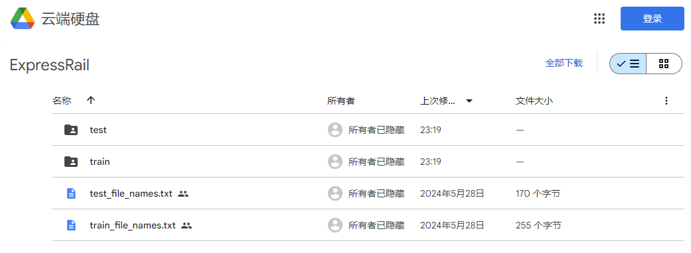

# 铁路点云数据集发布说明

## 1 数据下载
我们将数据已上传至Google Drive，
您只需要填写一个简短的 
[数据请求表单](https://docs.google.com/forms/d/e/1FAIpQLSdYAQAkmjV3myVWRDSg_TA322uQs68rpNATdC_iPvXvYwXSrw/viewform)
，即可获取下载链接！

## 2 数据划分
我们基于样本分布均衡原则，划分了测试集和验证集。验证集如果需要的话，建议从测试集中按需划分。
整个数据集共有208,903,444个点，训练集有122,844,607(59%), 测试集有86,058,837(41%)。详细的数据分布见下表：

| Category     | Training Set          |            | Test Set            |            |
|--------------|-----------------------|------------|---------------------|------------|
|              | Count                | Ratio (%)  | Count              | Ratio (%)  |
| **Rail**     | 4,868,175            | 3.96%      | 3,557,249          | 4.13%      |
| **Support**  | 496,592              | 0.40%      | 313,780            | 0.36%      |
| **Pillar**   | 1,122,971            | 0.91%      | 717,138            | 0.83%      |
| **Overhead** | 1,508,587            | 1.23%      | 1,014,536          | 1.18%      |
| **Fence**    | 10,277,848           | 8.37%      | 9,880,912          | 11.48%     |
| **Bed**      | 58,095,906           | 47.29%     | 42,415,688         | 49.29%     |
| **Vegetation**| 23,863,152          | 19.43%     | 13,360,557         | 15.52%     |
| **Ground**   | 17,406,618           | 14.17%     | 11,444,937         | 13.30%     |
| **Others**   | 5,204,758            | 4.24%      | 3,354,040          | 3.90%      |
| **Total**    | 122,844,607          | 100%       | 86,058,837         | 100%       |

## 3 联系方式

如有任何问题或建议，请联系数据集维护者：

姓名：leung 邮箱：gisleung@whu.edu.cn
